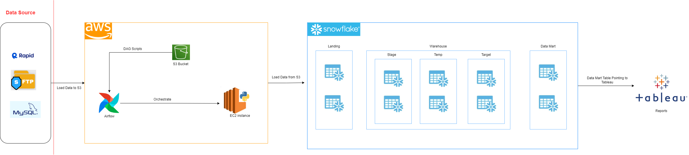

# ETL-Framework
## What is it?

This repository hosts an ETL framework designed to streamline data extraction, transformation, and loading processes. It fetches data from diverse source systems, including APIs, database(MySQL), and FTP servers, ensuring compatibility with a range of input formats. Built with scalability in mind, this framework serves as a foundation for managing data pipelines across multiple systems. While the current implementation targets specific sources, the architecture is extensible, allowing for seamless integration with additional databases(oracle, SQL Server etc.) and data sources in the future.

## Features
- Performs extraction from multiple source systems, including APIs, databases, and FTP servers.
- Modular architecture allows seamless integration of new data sources.
- Separates extraction and loading scripts for maintainability and scalability.
  - Enables the addition of new functional areas and easy adaptation of existing logic.
- Includes a logging mechanism that generates log files for each script and stores logging information in the database for easy monitoring and debugging.
- Provides an audit feature to ensure that only the desired scripts are executed.
- Fully integrated with AWS and Snowflake, widely used in data engineering architectures.
- Contains DAG files for orchestrating data pipelines using Airflow.
- Offers a library for key tasks, such as logging, AWS interaction, Snowflake operations, and more, making it easy to extend functionality.

---

## Architecture Diagram
The following diagram illustrates the architecture of the framework:

- **Extraction Process**: Extracts files from source systems (APIs, databases, FTP) and uploads them to an S3 bucket.
- **Loading Process**: Loads data from the S3 bucket to the landing, target tables and semantic/data mart tables in Snowflake.
- Python Scripts run on the EC2 orchestrated by Airflow managed by AWS (AWS MWAA )

## Technologies Used
- **Python**
- **Snowflake**
- **AWS (EC2, S3, Managed Airflow)**
- **Tableau**
- **MySQL**
- **API services**

## Dependencies (Getting Started)
If you're a student, you can implement this framework with minimal cost. Here's what you'll need:
- **Python 3.10 or above**
- **Snowflake** (Free Trial account: [Snowflake Free Trial](https://www.snowflake.com/free-trial/))
- **AWS** (Free tier covers EC2 and S3, but Airflow and VPC services incur charges: [AWS Free Tier](https://aws.amazon.com/free/))
- **RapidAPI** (Free tier is sufficient: [RapidAPI](https://rapidapi.com/))
- **Tableau Public** (Free: [Tableau Public](https://public.tableau.com/en-us/s/))

## Configuration
1. **Set Up**:
   - Create a Python virtual environment.
   - Install all dependencies from `requirements.txt`.

2. **Environment Variables**:
   - For local runs, use the `.env` file to store configurations like credentials.
   - For deployment on EC2, use the provided `.sh` script to set the environment variables.

3. **Database Setup**:
   - Use the provided `DDL` file to create all necessary database tables and seed data.

---

## Error Handling and Logging
- Each script generates a log file stored in the `log` folder for debugging and error tracking.
- Logs include detailed information to help identify issues and resolve them quickly.

---

## Enhancement
Future updates to the framework will include:
1. Retry mechanisms for API and extraction scripts in case of failures.
2. Integration with additional databases and services.
3. Email and notification services for batch processes.